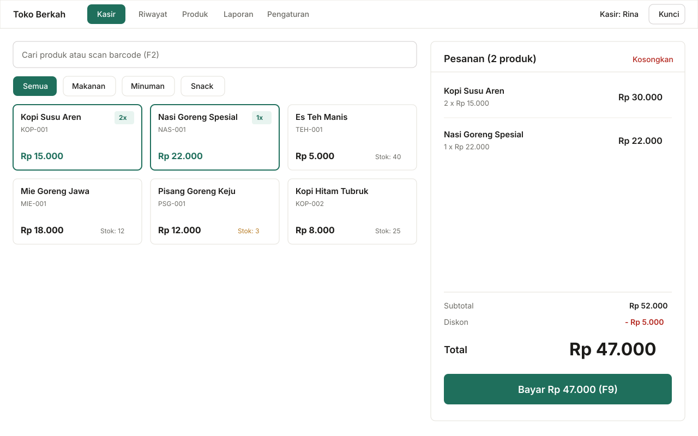

<div align="center">

  

# Kasir Terbuka

### A Modern, Local-First, Offline Point-of-Sale System

**A free, open-source, and distraction-free point-of-sale application designed for small retailers and food & beverage shops (warung, cafes, grocery stores).**
<br>
Available on Windows, Android, macOS, Linux, and Web PWA &bull; Zero subscription fees &bull; 100% local data privacy.

  <br>

[](https://github.com/Fizm00/POS-KasirTerbuka/releases/latest)
[](LICENSE)
[](apps/pos)
[](#why-kasir-terbuka)
[](#multi-platform-downloads)

  <br>

[**Launch Web PWA**](https://fizm00.github.io/POS-KasirTerbuka/) &nbsp;&bull;&nbsp;
[**Download Binaries**](#multi-platform-downloads) &nbsp;&bull;&nbsp;
[**Key Features**](#key-features) &nbsp;&bull;&nbsp;
[**Printer Setup**](docs/printer-setup.md) &nbsp;&bull;&nbsp;
[**User Guide**](docs/user-guide.md)

  <br>
  <br>

  

</div>

<br>

---

## Why Kasir Terbuka?

Kasir Terbuka was created to solve the real operational challenges faced by small shop owners, grocery stores, cafes, and independent merchants in Indonesia who need a point-of-sale system that is **fast**, **subscription-free**, **fully operational without internet**, and **completely under the owner's control**.

| Core Principle                     | Details                                                                                                                                                                                                      |
| :--------------------------------- | :----------------------------------------------------------------------------------------------------------------------------------------------------------------------------------------------------------- |
| **100% Local-First & Offline**     | **No backend server, no cloud accounts, and zero monthly subscriptions.** All database records are stored directly on the device using IndexedDB via Dexie.js. Business data never leaves the local machine. |
| **Fast at the Counter (< 30s)**    | Built specifically for high-throughput counters. Full keyboard navigation (`F2` to search products or scan barcodes, `F9` for instant checkout), barcode scanner support, and automatic change calculations. |
| **Broad Thermal Printing Support** | Prints 58 mm and 80 mm receipts natively using raw ESC/POS command streams via USB, Bluetooth SPP (Android), WebSerial, WebUSB, and LAN/Wi-Fi TCP sockets.                                                   |
| **Inventory & Movement Auditing**  | Includes Bulk Stock-In for purchase receipts, physical stock opname adjustments, delta calculations, audit logs, low-stock warnings, and real-time inventory valuation.                                      |
| **Bulk Catalog Import (CSV)**      | Import hundreds of products and categories in seconds using standard CSV spreadsheets with automated schema validation and duplicate SKU guards.                                                             |
| **Local PIN & Staff Permissions**  | Role-based permissions (`admin` vs `kasir`), PBKDF2 salted hash encryption, configurable inactivity auto-lock (1–15 minutes), and protected transaction void flows.                                          |
| **Atomic Data Backup**             | Export complete transaction histories, catalog items, and store settings into a single backup archive, with safe atomic imports validated via Zod.                                                           |

---

## Multi-Platform Downloads

Prebuilt binaries and installers are available from the **[Latest v1.1.0 Release](https://github.com/Fizm00/POS-KasirTerbuka/releases/latest)**:

| Platform    | Package Format        | Target Architecture               | Direct Download Link                                                                                                                             | Installation Guide                                        |
| :---------- | :-------------------- | :-------------------------------- | :----------------------------------------------------------------------------------------------------------------------------------------------- | :-------------------------------------------------------- |
| **Windows** | Setup `.exe` / `.msi` | x64 (Windows 10 / 11)             | [**Kasir.Terbuka_1.1.0_x64-setup.exe**](https://github.com/Fizm00/POS-KasirTerbuka/releases/download/v1.1.0/Kasir.Terbuka_1.1.0_x64-setup.exe)   | [Desktop Guide](docs/desktop-installation.md)             |
| **Android** | Package `.apk`        | Universal / ARM64 (Android 8–15)  | [**Kasir-Terbuka-android-debug.apk**](https://github.com/Fizm00/POS-KasirTerbuka/releases/download/v1.1.0/Kasir-Terbuka-android-debug.apk)       | [Android Guide](docs/android-setup.md)                    |
| **macOS**   | Disk Image `.dmg`     | Universal (Apple Silicon & Intel) | [**Kasir.Terbuka_1.1.0_universal.dmg**](https://github.com/Fizm00/POS-KasirTerbuka/releases/download/v1.1.0/Kasir.Terbuka_1.1.0_universal.dmg)   | [Desktop Guide](docs/desktop-installation.md)             |
| **Linux**   | `.AppImage` / `.deb`  | x86_64 / amd64                    | [**Kasir.Terbuka_1.1.0_amd64.AppImage**](https://github.com/Fizm00/POS-KasirTerbuka/releases/download/v1.1.0/Kasir.Terbuka_1.1.0_amd64.AppImage) | [Desktop Guide](docs/desktop-installation.md)             |
| **Web PWA** | Standalone Web App    | Any Modern Browser                | [**Launch Kasir Terbuka Web**](https://fizm00.github.io/POS-KasirTerbuka/)                                                                       | [PWA Instructions](#progressive-web-app-pwa-installation) |

> **Note on Desktop & Android Installers:** Because this is an open-source community release without paid commercial code-signing certificates, operating systems may display a SmartScreen warning ("Windows protected your PC") or Android Play Protect prompt. You can safely proceed by clicking **"More info" -> "Run anyway"** on Windows or **"Install anyway"** on Android. Read the [Desktop Installation Guide](docs/desktop-installation.md) and [Android Setup Guide](docs/android-setup.md) for verification details.

---

## Key Features

### 1. Cashier Terminal (`/kasir`)

- **Rapid Search & Barcode Scanning:** Press `F2` to focus the search box or scan barcodes directly using USB or Bluetooth HID barcode scanners.
- **Responsive Cart Management:** Adjust quantities, remove items, and preview subtotals with zero latency.
- **Flexible Discounts:** Support for nominal Rupiah (`Rp`) and percentage (`%`) discounts with transparent calculations.
- **Low-Stock Alerts:** Non-intrusive warnings when stock drops below threshold, with automatic prevention of out-of-stock transactions.
- **Multiple Payment Modes:** Cash (with automatic change calculation and quick denomination buttons), static QRIS, and bank transfers.
- **Instant Receipt Generation:** Generates daily sequential invoice numbers (`INV-YYYYMMDD-0001`) and triggers thermal printing.

### 2. Product Catalog & Inventory (`/produk` and `/stok-masuk`)

- **Comprehensive Catalog Management:** Full CRUD for products, categories, SKU, cost price, selling price, and stock levels.
- **Bulk CSV Import:** Batch import products with duplicate SKU prevention, error reporting, and downloadable official templates.
- **Stock Movement Audit Log:** Track every quantity change (Stock-In, Physical Opname Adjustments, Sales, Void/Cancellations).
- **Bulk Stock-In Page (`/stok-masuk`):** Batch-receive incoming items from suppliers in a streamlined single-page workflow.
- **Real-Time Inventory Valuation:** Automatically compute total inventory cost value based on active stock levels.

### 3. Financial Reports & Sales Analytics (`/laporan`)

- **Key Business Metrics:** Total gross revenue, transaction counts, average order value (AOV), gross profit, and inventory valuation.
- **Flexible Date Ranges:** Today, Last 7 Days, This Month, or custom date pickers.
- **Daily Sales Trends:** Clean, high-contrast bar charts for daily sales volume.
- **Best-Selling Products:** Top-performing items ranked by volume and revenue.
- **CSV Accounting Export:** Export comprehensive financial summaries and itemized sales lines for Microsoft Excel or Google Sheets.

### 4. Transaction History & Void Management (`/riwayat`)

- **Historical Search:** Filter records by date range, cashier name, and transaction status (Completed / Voided).
- **Item Snapshot & Reprinting:** Preserves historical prices and names at the time of purchase; reprint thermal receipts at any time.
- **Atomic Void Protection:** Requires admin authorization; logs the cancellation reason and safely restores stock levels in a single transaction.

### 5. Staff Management & Local Security (`/pengguna`)

- **Role-Based Access Control:** `admin` (full system access) and `kasir` (cashier terminal and basic history only).
- **Cryptographic PIN Hashing:** Local PIN authentication secured with salted PBKDF2 hashing via the Web Crypto API.
- **Automatic Screen Lock:** Configurable timeout (1–15 minutes) to protect unattended cashier counters.

### 6. Store Settings & Atomic Backup (`/pengaturan`)

- **Receipt Customization:** Configure store name, address, phone number, custom footer notes, and paper width (58 mm or 80 mm).
- **Single-File Atomic Backup:** Full JSON database export with pre-flight entity validation and atomic restoration via Zod.
- **Persistent Storage Request:** Automatically invokes `navigator.storage.persist()` to safeguard local data against browser cache cleanup.

---

## Thermal Printer Integration (ESC/POS)

Kasir Terbuka implements a pure TypeScript byte encoder to convert transaction data into standard **ESC/POS byte streams**:

```
+--------------------------------+
|          TOKO BERKAH           |
|    Jl. Sudirman No. 12, Jkt    |
|--------------------------------|
| INV-20261010-0001              |
| 10/10/2026 14:30   Kasir: Rina |
|--------------------------------|
| Kopi Susu Aren                 |
| 2 x Rp 15.000        Rp 30.000 |
| Nasi Goreng                    |
| 1 x Rp 22.000        Rp 22.000 |
|--------------------------------|
| Subtotal:            Rp 52.000 |
| Total:               Rp 52.000 |
| Cash:                Rp 60.000 |
| Change:               Rp 8.000 |
|--------------------------------|
|      Thank you for your        |
|            visit!              |
+--------------------------------+
```

### Supported Transports & Drivers

- **Desktop (Tauri 2):** Native USB raw sockets, Serial COM ports, and TCP/IP network sockets (LAN / Wi-Fi).
- **Android (Capacitor):** Bluetooth Classic SPP (`RFCOMM`) with auto-discovery of paired thermal printers.
- **Browser (PWA):** WebSerial API, WebUSB API, WebBluetooth API, and standard browser print (`window.print()`) with print CSS optimized for 58 mm and 80 mm thermal rolls.

_For complete wiring, baud rate settings, and troubleshooting instructions, see the [Thermal Printer Setup Guide](docs/printer-setup.md)._

---

## Progressive Web App (PWA) Installation

Kasir Terbuka can be installed directly from modern browsers without downloading separate installer files:

1. **Desktop (Google Chrome / Microsoft Edge):**
   - Navigate to the [Kasir Terbuka Web App](https://fizm00.github.io/POS-KasirTerbuka/).
   - Click the install icon in the address bar, or open the browser menu and select **"Install Kasir Terbuka"**.
   - The application launches in a standalone window with full offline precaching.
2. **Android (Google Chrome):**
   - Open the web application in Chrome.
   - Tap the three dots menu in the top-right corner.
   - Select **"Add to Home screen"** or **"Install app"**.
3. **iOS / iPadOS (Safari):**
   - Open the web application in Safari.
   - Tap the **Share** button at the bottom or top of the browser.
   - Select **"Add to Home Screen"**.

---

## Monorepo Architecture & Technology Stack

The repository is structured as a `pnpm workspace` monorepo:

```
POS-KasirTerbuka/
├── apps/
│   ├── pos/                  # Cashier Application (PWA, Tauri Desktop, Capacitor Android)
│   │   ├── src/
│   │   │   ├── app/          # App router and context providers
│   │   │   ├── components/   # Shared UI primitives (Button, Modal, Input, Table)
│   │   │   ├── db/           # Dexie IndexedDB schema and repository layer
│   │   │   ├── features/     # Feature modules (pos, products, reports, auth, settings)
│   │   │   ├── lib/          # Utility functions (money, dates, csv, features)
│   │   │   └── printing/     # ESC/POS byte builder and driver adapters
│   │   ├── src-tauri/        # Native desktop shell (Tauri 2 + Rust)
│   │   └── android/          # Native Android shell (Capacitor + Java)
│   └── landing/              # Marketing showcase and download site (React 19 + Vite)
├── docs/                     # Official documentation and technical guides
└── .github/workflows/        # CI/CD pipelines and multi-platform release builds
```

### Technology Stack

| Layer                | Technology                    | Details                                                           |
| :------------------- | :---------------------------- | :---------------------------------------------------------------- |
| **Language**         | TypeScript (Strict mode)      | 100% type-safe codebase with zero untyped structures              |
| **UI Framework**     | React 19 + Vite               | High rendering performance, instant HMR, minimal bundle size      |
| **Styling**          | Tailwind CSS v4               | Semantic design tokens with high-contrast accessibility standards |
| **Local Database**   | Dexie.js (IndexedDB)          | Atomic transactions, schema version upgrades, 100% client-side    |
| **State Management** | Zustand                       | Lightweight UI and shopping cart state management                 |
| **Validation**       | Zod + React Hook Form         | Strict schema validation for user input and data imports          |
| **Typography**       | Plus Jakarta Sans             | Bundled locally for complete offline availability                 |
| **Test Suite**       | Vitest + RTL + fake-indexeddb | **283 unit & integration tests passing (100% pass rate)**         |
| **Desktop Shell**    | Tauri 2 (Rust)                | Minimal memory footprint (~15 MB RAM) with native hardware access |
| **Mobile Shell**     | Capacitor (Android)           | Native Bluetooth Classic SPP printer integration                  |

---

## Developer Quickstart

### Prerequisites

- [Node.js](https://nodejs.org/) v20 or newer
- [pnpm](https://pnpm.io/) v10 or v12
- [Rust](https://rustup.rs/) _(optional, required only for building Tauri desktop apps)_
- [Android Studio & JDK 21](https://developer.android.com/studio) _(optional, required only for building Android APKs)_

### Local Setup

```bash
# 1. Clone the repository
git clone https://github.com/Fizm00/POS-KasirTerbuka.git
cd POS-KasirTerbuka

# 2. Install workspace dependencies
pnpm install

# 3. Start the cashier development server
pnpm dev:pos

# 4. (Optional) Start the marketing landing page in another terminal
pnpm dev:landing
```

Open `http://localhost:5173` in your browser. On first launch, the setup wizard will prompt you to configure your store name and create your admin PIN.

### Testing and Code Quality

```bash
pnpm -r test                  # Run unit and integration tests across all packages (Vitest)
pnpm -r typecheck             # Perform TypeScript type-checking
pnpm -r lint                  # Run ESLint validation
pnpm format                   # Format code using Prettier
pnpm --filter pos tauri dev   # Run the native Tauri desktop app in dev mode
pnpm --filter pos cap sync    # Synchronize web assets to Capacitor Android
```

---

## Documentation Index

Detailed operational and technical documentation is maintained in the [`docs/`](docs/) directory:

- [**User Guide (Panduan Pengguna)**](docs/user-guide.md) — Comprehensive user manual for store operations, transactions, and reports.
- [**Android Setup & Sideloading**](docs/android-setup.md) — APK installation, Bluetooth runtime permissions, and printer pairing.
- [**Desktop Installation Guide**](docs/desktop-installation.md) — Windows, macOS, and Linux setup instructions and SmartScreen verification.
- [**Thermal Printer Setup (ESC/POS)**](docs/printer-setup.md) — Hardware wiring, serial baud rates, and printer connectivity.
- [**CSV Export Specification**](docs/csv-export.md) — Column schema definitions for exported reports and transaction data.
- [**Contributing Guidelines**](docs/contributing.md) — Coding standards, git conventions, and pull request workflows.

---

## Contributing

Kasir Terbuka is an open-source project dedicated to supporting independent businesses and small shops with accessible, private, and durable software. Contributions in the form of bug reports, code improvements, translations, and printer hardware testing are welcome.

Please review the [Contributing Guidelines](docs/contributing.md) before submitting a pull request.

---

## License

This project is licensed under the **[GNU Affero General Public License v3.0 (AGPL-3.0)](LICENSE)**.

Copyright &copy; 2026 **Kasir Terbuka Contributors**.
